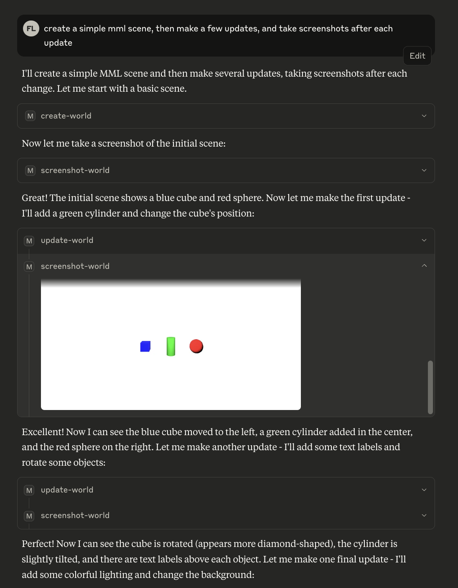

# MML MCP Server

A comprehensive **Model Context Protocol (MCP) server** for **Metaverse Markup Language (MML)** that enables models to iteratively design, build, and refine interactive worlds through both automated and manual feedback loops.



## Development

```
npm i
npm run dev
```

By default this will:
- run a local MCP server (defaulting to a `streamable-http` transport)
- config local cursor and claude mcp tooling with for the local mml mcp server
- start a playable 3D web world (user can walk around the 3D world as the agent creates in real-time)
- various auxiliary supporting services 

### Other transports

Other transports can be run by suffixing the desired transport, eg.
```
npm run dev:stdio
npm run dev:sse
```

## Testing

Some initial regression tests exist in the top-level `tests` folder, runnable with 
```
npm run test
```

## Next Steps
- enable a workflow where a chatbox/history embedded in the game client interfaces with the LLM
- change the update tool to patch individual elements rather than the whole scene (reduce time between updates)
- prompt the model to support better use of the MCP server (elicit continuous update iterations, more scrutiny of screenshots, etc)
- enable the screenshot to be support the model providing perspectives (pos + POV)
- deploy it (plan to try serverless functions impl, unidiomatic to MCP but nice scaling if works)
- demonstrate extending MCP toolset (eg. 3d model generation tool, flammability)
- plan how to expose non-server-side elements to LLM (eg. changing client UI, player character model, etc)